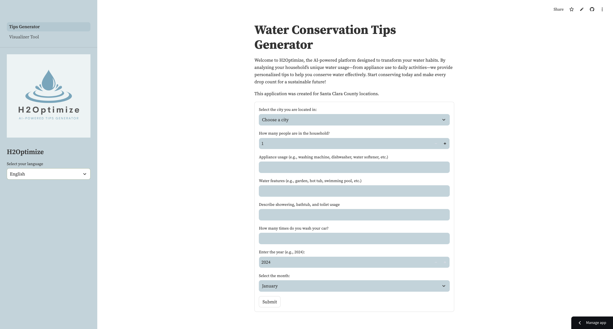
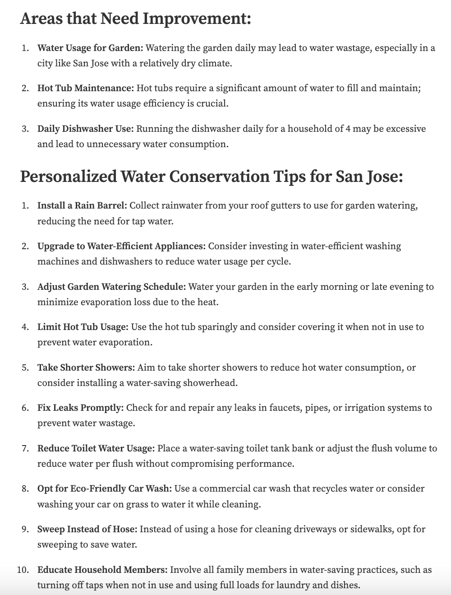
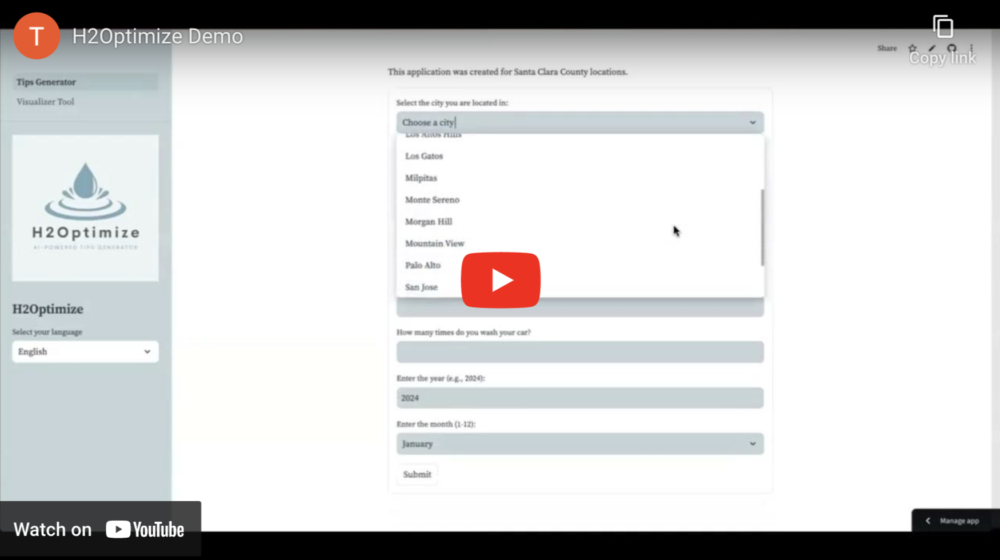

# H2Optimize

## What is H2Optimize?
H2Optimize is an AI-powered water habits system that tackles the issue of water conservation in Santa Clara County.

## Our Solution
Our application has three features that include delivering personalized water conservation tips, generating custom visuals, and providing multilingual support. Users will input their answers to questions regarding their water usage. The topics consist of city location, number of people in the household, appliance usage, water features, personal usage, and the current year and month. H2Optimize will generate 10 conservation tips using the user's input and county average temperature data (from a Santa Clara County Weather History dataset). Next, the user can produce custom visuals (using OpenAI Dall-E) which help visualize water conservations tips or keywords. Lastly, the multilingual support feature in the sidebar allows users to select their preferred language for easier navigation throughout the tips generator. We offer Spanish, Mandarin, Cantonese, and Vietnamese translation options.

## Personalized Water Tips Generator

  
  

## H2Optimize in Action

